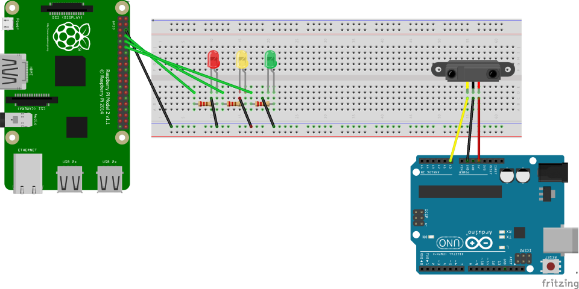
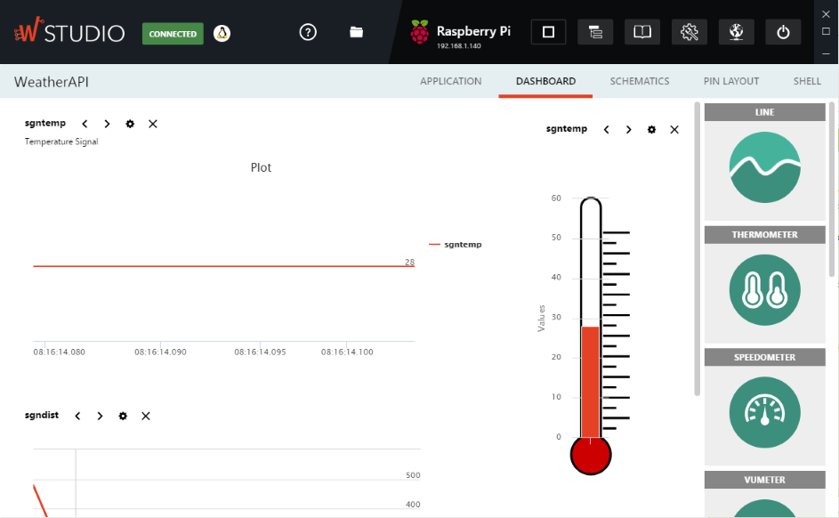
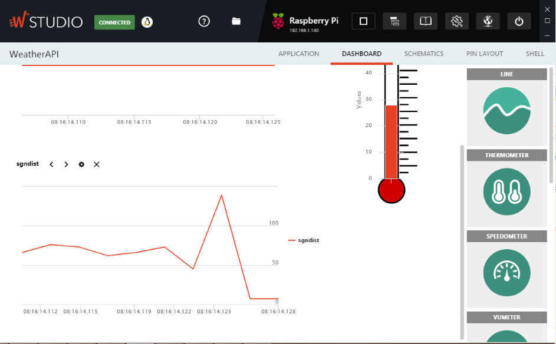

# Algo
a bit of everything
    
  
### Device that on proximity displays the temperature (API) based on 3 intervals

>> Fritzing diagram and Wyliodrin project available

https://github.com/WiringPi/WiringPi-Python/pull/51

https://github.com/WiringPi/WiringPi-Python/issues/47

