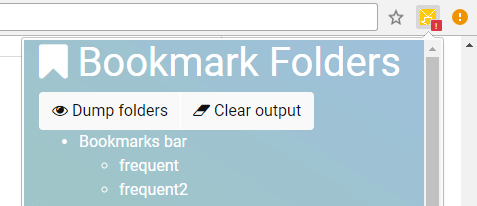
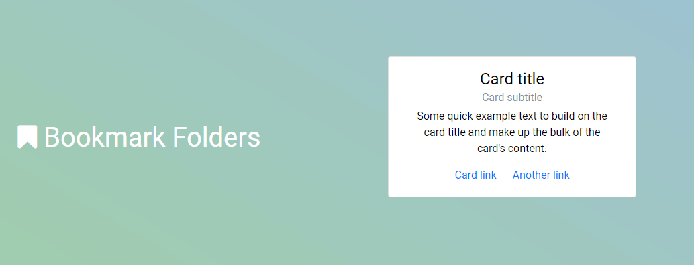

# Algo
a bit of everything
## Chrome Bookmark Manager extension (Chrome API)

    
    

Productivity tool.

### Features:
+ [x] simplified, faster folder recursion (not using 3 functions for one thing)
+ [x] styling with Bootstrap 4 Beta
+ [x] click on link to open new tab for extension
  + [ ] problem with extension link vs default link for `Chrome Bookmark Manager`
+ [ ] search bar
+ [ ] collapsible folders
+ [ ] bookmark statistics page
  + [ ] contextual menus (on extension icon right click)
  + [ ] dashboard with visualizations
+ [ ] bookmark settings page (started)

### Useful links
+ `My Bookmarks` from the Chrome API documentation - [developer.chrome.com/extensions/samples#search:my%20bookmarks](https://developer.chrome.com/extensions/samples#search:my%20bookmarks).